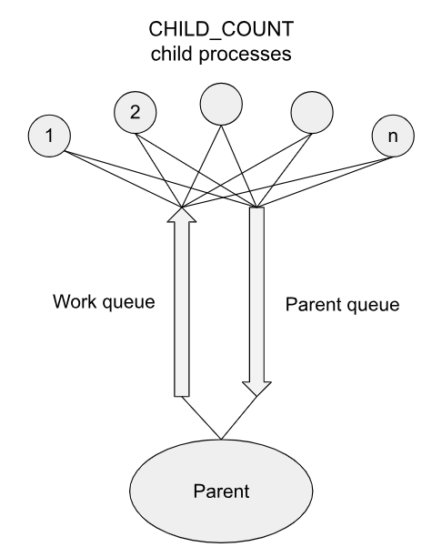

# README - Monte Carlo Pi Approximation using POSIX Queues

This directory contains a C program designed to demonstrate the use of POSIX queues and handling them with signals, by approximating the value of π using the Monte Carlo method. The program leverages POSIX message queues and processes to generate random points within a unit square and concurently check how many of these points lie inside a unit circle. The overall goal is to compute π based on the ratio of points inside the circle to the total number of points generated.

## Program Overview

The program simulates a Monte Carlo method for approximating π by generating random points in the unit square `[-1, 1]^2`. The program consists of a parent process that creates child processes to perform computations and communicate using POSIX message queues.

### Key Steps:

1. **Parent Process**: Generates random points and sends them to child processes using a work queue. It also listens to results from child processes and computes the approximation of π.
2. **Child Processes**: Each child process receives points from the work queue, checks if they lie within the unit circle, and returns the result to the parent process.
3. **Message Queues**: The program uses two POSIX message queues:
   - A parent queue for sending results back to the parent process.
   - A work queue for sending points to the children for computation.

  

## Key Concepts and Features

- **POSIX Message Queues**: The parent and work queues facilitate communication between the parent and child processes.
- **Forked Child Processes**: Multiple child processes are created to handle different parts of the computation in parallel.
- **Monte Carlo Method**: Random points are generated, and their position relative to the unit circle is used to approximate π.
- **Signal Handling**: The program handles signals to ensure proper synchronization and error-free operation.
- **Error Handling**: Comprehensive error handling is implemented for message queue operations, process management, and memory allocations.

## Usage

To build and run the program, follow the instructions below:

### Step 1: Build the Program
Compile the program using the provided Makefile:

```bash
make
```

This will compile the program with the necessary flags.

### Step 2: Run the Program
Execute the program with the default configuration (no arguments are needed for this task):

```bash
./ops-queue
```

### Step 3: Program Behavior
- The program creates a set number of child processes to compute the Monte Carlo approximation of π.
- Each child computes whether random points fall within a unit circle.
- The program prints the running approximation of π to the console as it progresses.

### Example Output
The program outputs the approximation of π as it processes the points:

```
Pi approximation: 3.145672
Pi approximation: 3.141276
Pi approximation: 3.141568
...
END
```

## Cleanup
The program cleans up after execution by:
- Closing and unlinking all message queues.
- Freeing any allocated memory.
- Terminating all child processes.

## Notes

- The program uses the `rand()` function to generate random float values in the range `[-1, 1]`.
- The `mq_notify` and `mq_receive` functions are used for efficient inter-process communication.
- Child processes are dynamically created based on the `CHILD_COUNT` constant and perform calculations concurrently.

