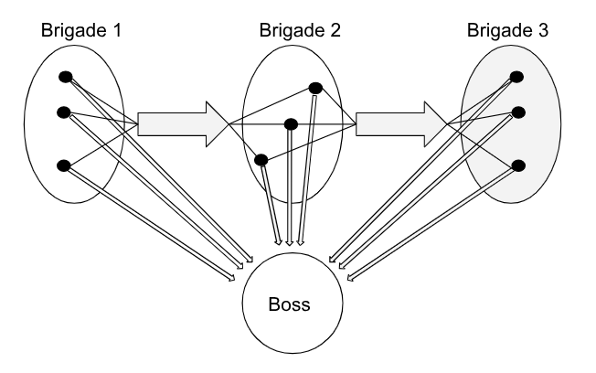
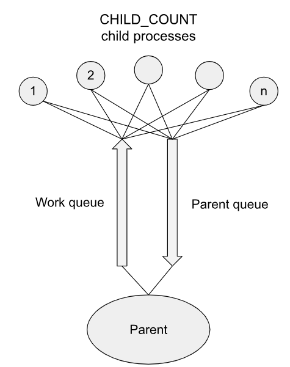

# README - My C codes

This repository contains C programs designed to demonstrate my knowledge of operating systems. The programs were written during my Operating Systems course and cover various concepts such as process management, inter-process communication (IPC), file handling, and more. Each program is placed in its own directory, allowing for focused exploration of specific topics.

## Repo Overview

## Pipes 

The program involves three groups of workers(processes) (referred to as brigades), each performing a specific task in the production pipeline:

1. **First Brigade (Workers w1)**: Reads data from a FIFO (named pipe) and passes it down the pipeline.
2. **Second Brigade (Workers w2)**: Reads data from the first brigade, processes it, and writes it to the next stage in the pipeline.
3. **Third Brigade (Workers w3)**: Reads data from the second brigade, processes it further, and prints the result when a complete "word" is formed.

The "boss" process supervises the entire workflow and ensures proper cleanup after the workers are 
done.

Each worker has its own pipe to the boss and shares a pipe to the next brigade with fellow workers. 
  

Open [PipesAndProcesses](./PipesAndProcesses) directory to see more. 

## Queues 

The program simulates a Monte Carlo method for approximating π. It consists of a parent process that creates child processes to perform computations and communicate using POSIX message queues, leveraging signals to synchonize them. The program's aim is to demonstrate the use of POSIX queues and processes. 

The program involves a group of child processes and a parent process. 

1. **Parent** randomly selects points in a square and sends them to children.
2. **Children** picks a point from the parent queue and decides whether it lies within the cirlce, then sends the result to the parent.
3. **Parent** receives results and basing on them calculates apprximation of π.

Schema of the program queue structure:

   

Open [QueuesProcessesAndSignals](./QueuesProcessesAndSignals) directory to see more. 

## Mapping memory  

This program implements a simulation of a dog race using multiple processes and inter-process synchronization through POSIX shared memory, mutexes, and barriers. The goal is to demonstrate synchronization between processes accessing and modifying shared data structures, and to simulate race dynamics with randomly moving dogs and live commentary.

Crucial code elements:  

1. **Dog Processes**: Each dog moves along the racetrack and tries to reach the end and return. Upon finishing, it writes its result to the shared leaderboard.
2. **Commentator Process**: Periodically prints the current state of the racetrack, showing dog positions and directions.
3. **Shared Memory**: All processes access a shared data structure (`sharedData_t`) that holds the track state, dog directions, positions, and the leaderboard.

Open [QueuesProcessesAndSignals](./SharedMemoryAndProcesses) directory to see more. 